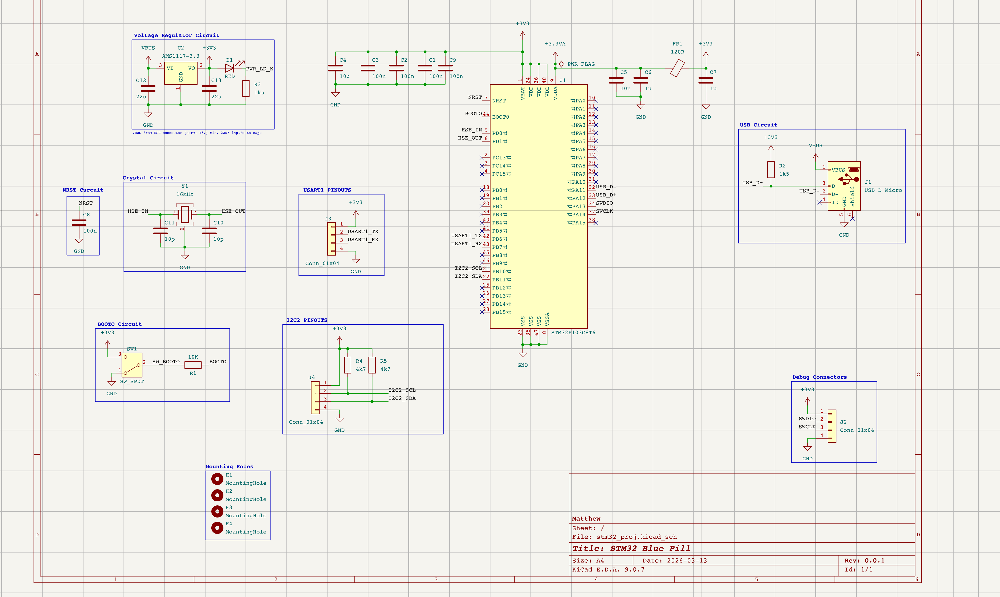
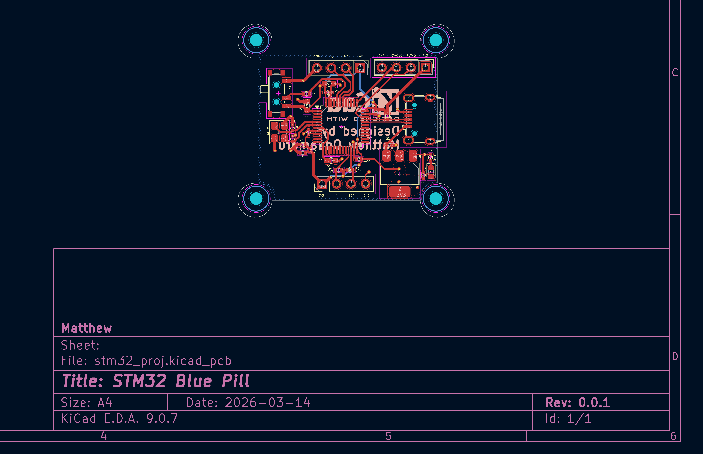
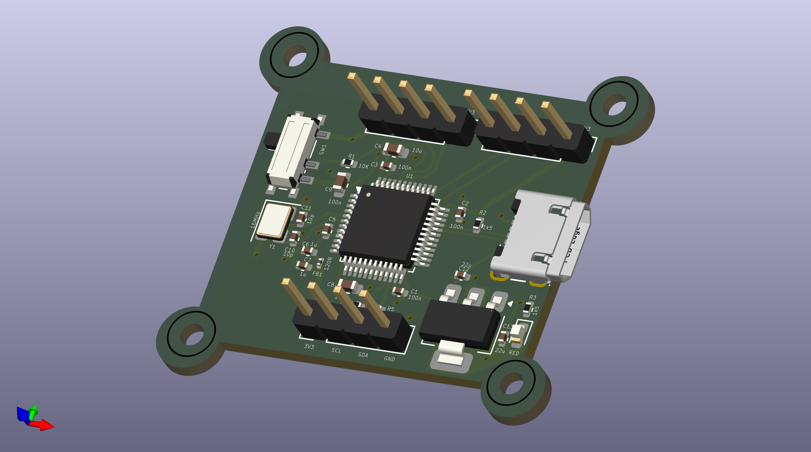
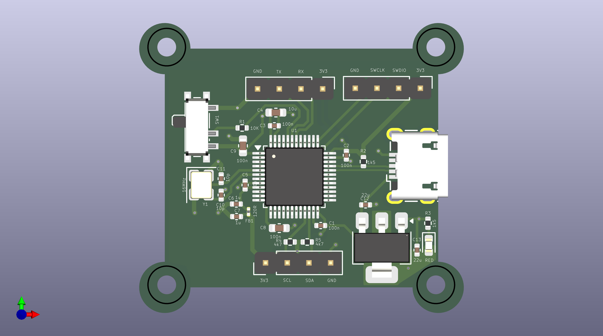
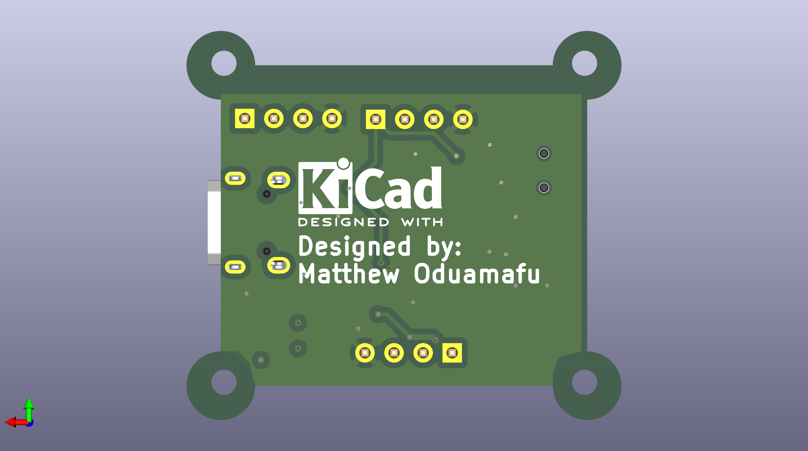

# STM32 Blue Pill PCB Project

A KiCad-based PCB design project featuring the STM32 Blue Pill (STM32F103C8T6) microcontroller. This repository contains the full schematic, PCB layout, and rendered views of the board.

---

## Schematic

---

## PCB Layout

---

## 3D Render

### Front

### Back

---

## Project Files

| File | Description |
|------|-------------|
| `stm32_proj.kicad_sch` | KiCad schematic file |
| `stm32_proj.kicad_pcb` | KiCad PCB layout file |
| `stm32_proj.kicad_pro` | KiCad project file |
| `stm32_proj.kicad_prl` | KiCad project local settings |

## Tools Used

- [KiCad EDA](https://www.kicad.org/) — schematic capture and PCB layout
